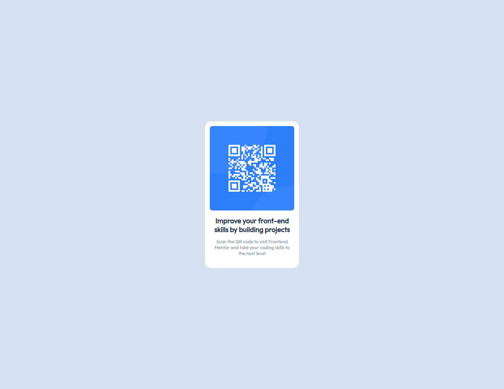

# Frontend Mentor - QR code component solution

This is a solution to the [QR code component challenge on Frontend Mentor](https://www.frontendmentor.io/challenges/qr-code-component-iux_sIO_H). Frontend Mentor challenges help you improve your coding skills by building realistic projects. 

## Table of contents

- [Overview](#overview)
  - [Screenshot](#screenshot)
  - [Links](#links)
- [My process](#my-process)
  - [Built with](#built-with)
  - [What I learned](#what-i-learned)
  - [Continued development](#continued-development)
  - [Useful resources](#useful-resources)
- [Author](#author)
- [Acknowledgments](#acknowledgments)

**Note: Delete this note and update the table of contents based on what sections you keep.**

## Overview

### Screenshot



### Links

- Solution URL: [Add solution URL here](https://your-solution-url.com)
- Live Site URL: [Add live site URL here](https://your-live-site-url.com)

## My process

### Built with

- Vanilla HTML & CSS
- ChatGPT for helping me

### What I learned

- Have learned to add custom fonts to a webpage
- I managed to get really close to the correct px for width and size

To see how you can add code snippets, see below:

To center elements on a page
```css
html,
body {
    height: 100%;
    width: 100%;
    background-color: hsl(212, 45%, 89%);
    align-items: center;
    display: flex;
    justify-content: center;
    height: 100%;
    width: 100%;
}
```

To import font
```html
  <style>
    @import url('https://fonts.googleapis.com/css2?family=Outfit');
  </style>
```


### Continued development

This was IMHO the most simple thing we can do and it took me a long time...
I need to learn if using a lot of % for margin etc... is really good


### Useful resources

ChatGPT <3
